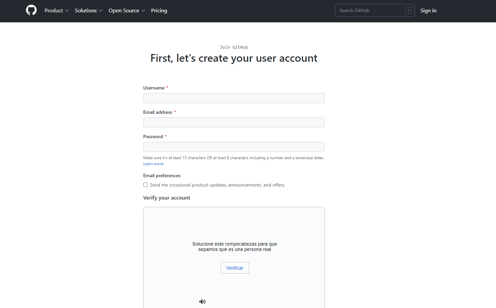
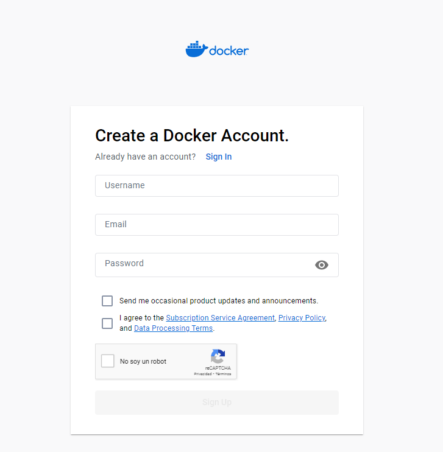
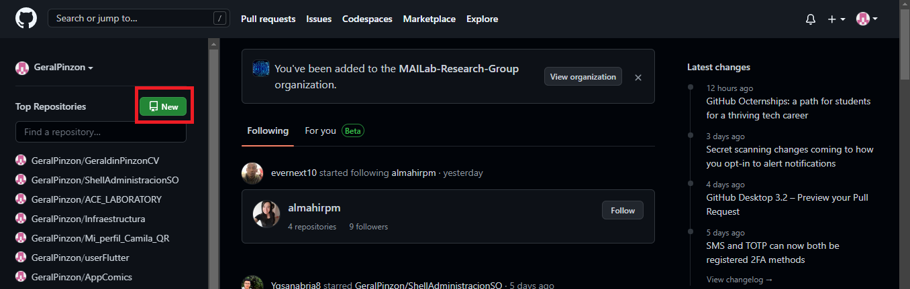
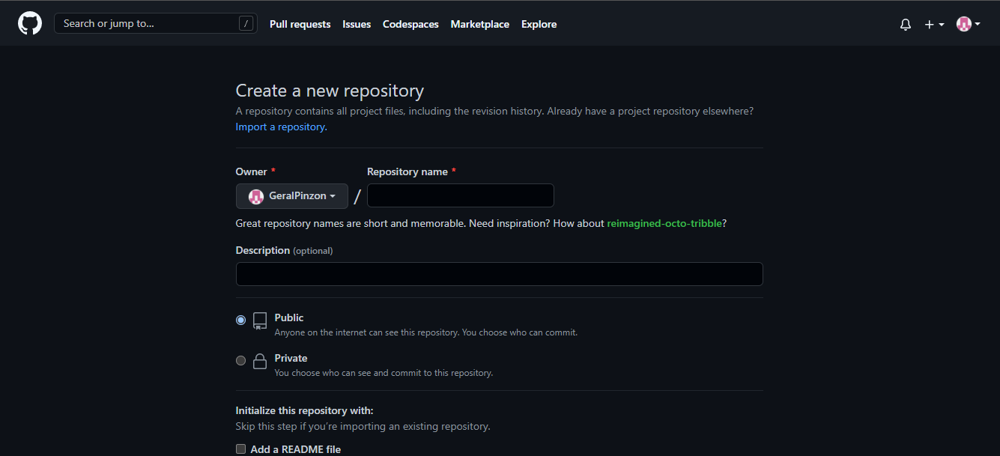

# Taller Docker 1


Configuración de herramienta de desarrollo

- Crear cuenta en Github

  Se debe crear una nueva cuenta en GitHub, ingresa al siguiente enlace https://github.com/join y llena los datos correspondientes.
  
  <p align="center">
  
  </p>

  
- Crear cuenta en Dockerhub

  Se debe crear una nueva cuenta en Docker, ingresa al siguiente sitio https://hub.docker.com/signup y llena los datos correspondientes.
  
  <p align="center">
  
  </p>
  
- Creación de repositorio
  
  Para crear un repositorio nuevo se debe ingresar a la cuenta creada anteriormente en GitHub, donde debera dar clic en el cuadro rojo que indica al boton NEW
  <p align="center">
  
  </p>
  
  Luego podra ver la siguiente pantalla, donde debera colocar el nombre del repositorio, indicar si es publico o privado y llenar demas datos.
  
  <p align="center">
  
  </p>

- Configuración de llaves SSH

  Primero debemos ubicarnos en el servidor que se esta trabajando, para generar las llaves SSH se debe ejecutar el comando ssh-keygen, despues de ejecutar este comando   se debe copiar la llave que se genero en la sigueinte ruta /home/ubuntu/.ssh/id_rsa.pub el archivo id_rsa.pub.
  
  
# Taller Docker 2

Agregar modulo de instalación de Docker en menú de administración para instalación y pruebas unitarias.

```bash
- ------------------------------------------------------------------------- -
- Server Name: [ubuntu-rancher]                                           
- ------------------------------------------------------------------------- -
- MENU: Install Container Linux Ubuntu                                      -
- ------------------------------------------------------------------------- -
- 1. Aprovisionar Servers              -  6.                                -
- 2. Subir Cambios Git                 -  7.                                -
- 3. Install Docker                    -  8.                                -
- 4. Install Rancher                   -  9.                                -
- 5. Install kubectl                   - 10.                                -
- ------------------------------------------------------------------------- -
- General                              -                                    -
- ------------------------------------ - ---------------------------------- -
- 14. Apagar Servidor                  -                                    -
- 15. Reiniciar Servidor               -                                    -
- 16. Cambiar password Usuarios        -                                    -
- ------------------------------------------------------------------------- -
- E. Exit                                                                   -
- ------------------------------------------------------------------------- -
Enter your choice [1-100] 
```


Subir cambios a repositorio

Clonar repositorio

Instalar Shell en servidor de AWS

Pruebas (docker –versión y Docker-compose --version)


