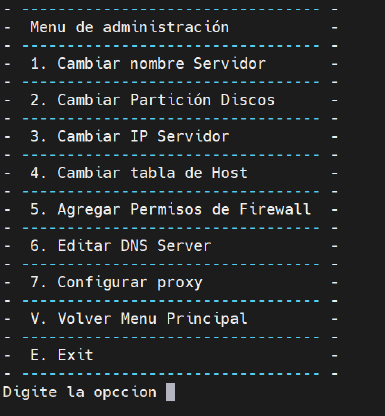
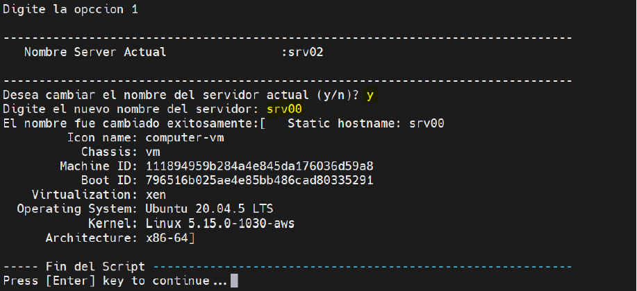
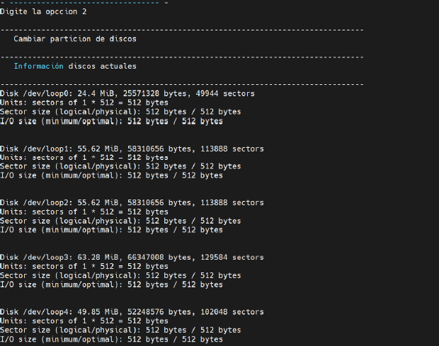
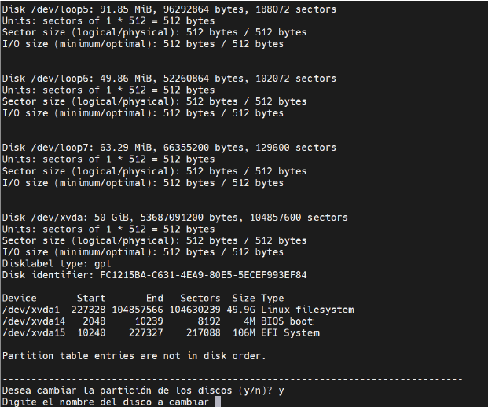
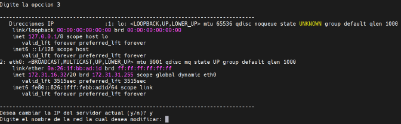
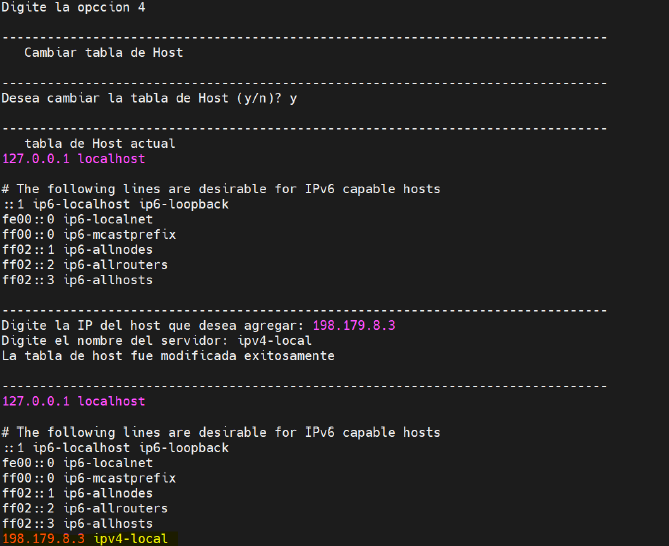
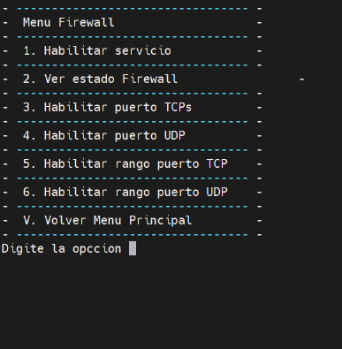
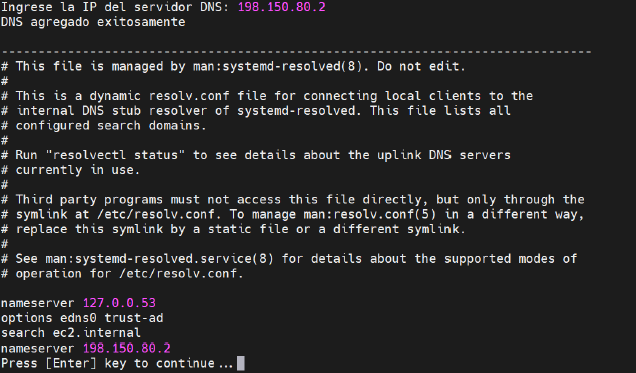
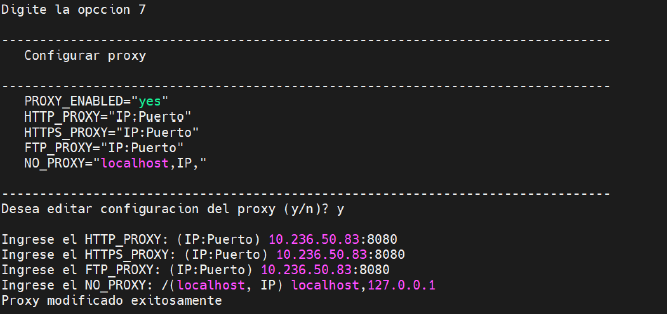
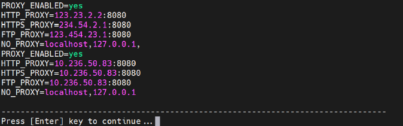

***Explicación de Shell de administración:***

Al ejecutar el respectivo Shell de administración, se podrá visualizar el siguiente menú:

Cuando se ingrese a la ***opción 1***,

se podrá ver el nombre del servidor actual y se le pedirá que confirme la opción para cambiar el nombre del servidor, luego deberá digitar el nuevo nombre del servidor dar enter, y podrá visualizar los cambios en la información que se le mostrará al ejecutarse correctamente la acción.

Al ingresar a la ***opción 2***,

se podrá ver la información de los discos actuales, de los cuales deberá escoger cual desea particionar, primero afirmando la acción y luego digite el nombre del disco, luego debe digitar m, y procederá a ver una lista de información con la que podrá guiarse para realizar la partición. Si el usuario desea salir de esa lista de ayuda debe digitar control+c.

En la ***opción 3***,

podrá ver las IPs actuales de las interfaces de red, luego deberá confirmar la acción, se pedirán tres datos que son el nombre de la red que va a modificar, la IP que
desea colocar y la máscara, si el proceso sale exitosa vera en consola la información de la red con la nueva IP.

En la ***opción 4***,

para cambiar la tabla de host, deberá verificar su acción, además debe dar dos datos, la IP del host que desea agregar, y el nombre del servidor que asignará, si la acción se ejecuta exitosamente se mostrara en consola el archivo que contiene la tabla de hosts y en la última línea podrá visualizar la IP que acaba de agregar.

En la ***opción 5***,

lo redirigirá a un menú que contiene diferentes opciones relacionadas con habilitar el servicio de firewall, ver el estado, habilitar puertos TCP/UDP o habilitar rango de puertos. En cada opción deberá confirmar su acción, y digitar la información solicitada, en caso de habilitar puertos debe ingresar el puerto que desea habilitar, en caso de habilitar rango de puertos deberá digitar del primer rango de puerto y el ultimo rango de puerto (puerto: puerto). Si desea ver los cambios luego de habilitar ciertos puertos podrá hacerlo por medio de la opción 2 que permite ver el estado de firewall, allí podrá ver los cambios.

En la ***opción 6***,

podrá editar el DNS server, debe confirmar la acción, ingresar la IP del servidor DNS que agregará, si es exitoso finalmente podrá ver en consola el archivo donde se encuentran los DNS.

En la ***opción 7***,

podrá configurar el PROXY, primero se mostrará un ejemplo de los datos que se requieren para configurar el proxy, luego debe confirmar la acción, después se le pedirán los datos que observo en la plantilla.

Si todo sale exitoso, se le mostrara en pantalla lo que se agregó al archivo .bashrc.

La ***opción V***, permite volver al menú principal.

La ***opción E***, permite salir de la ejecución del bash.

