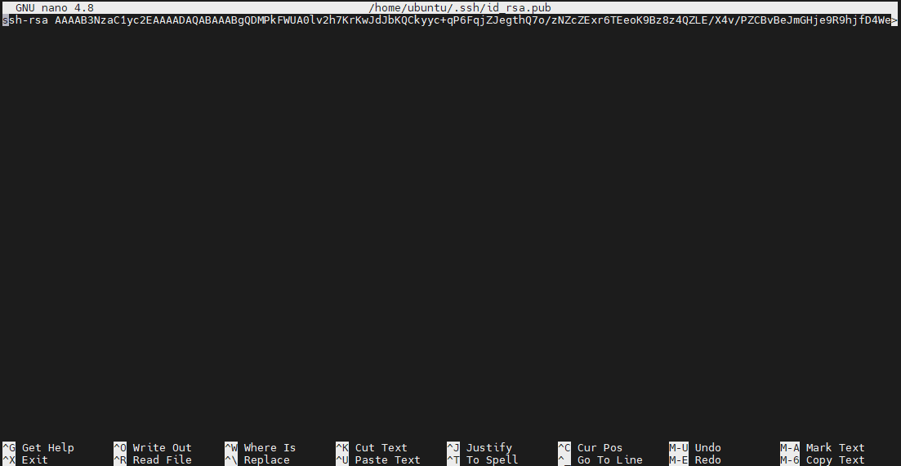
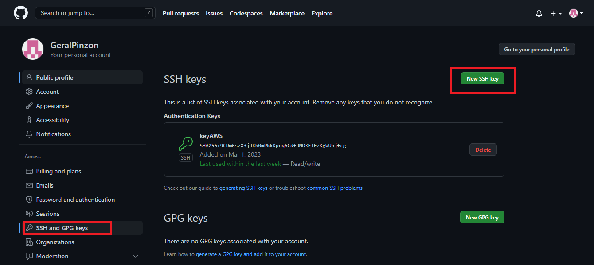
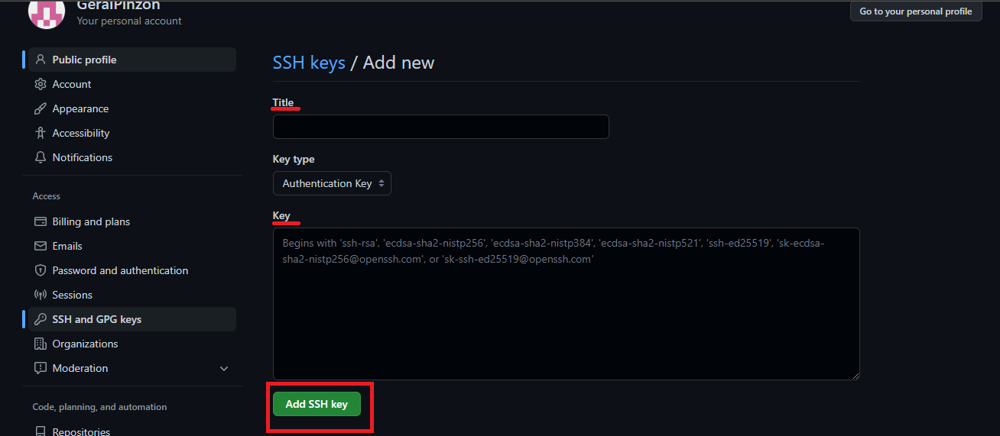
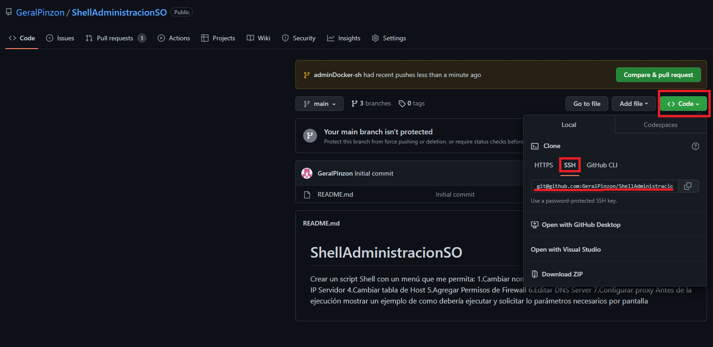
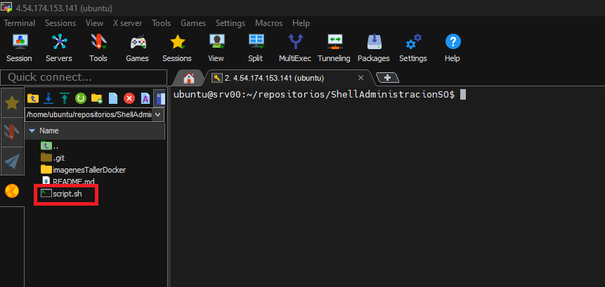
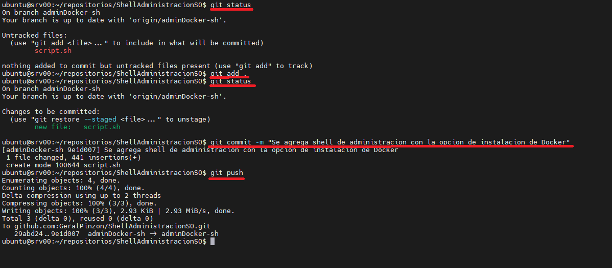
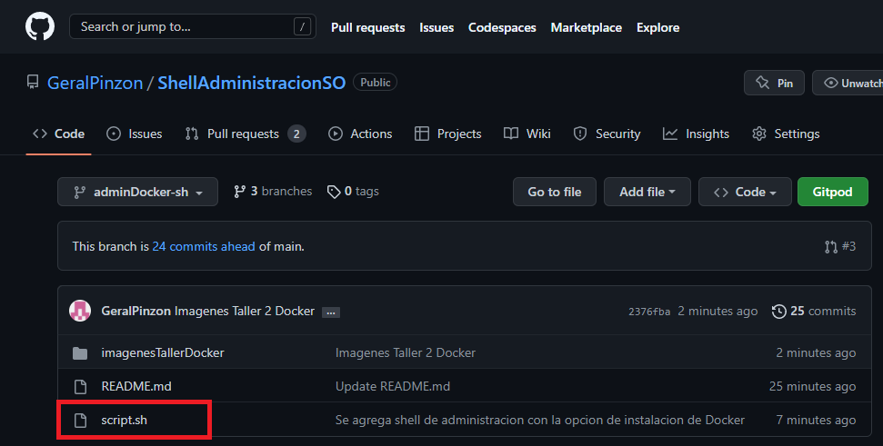
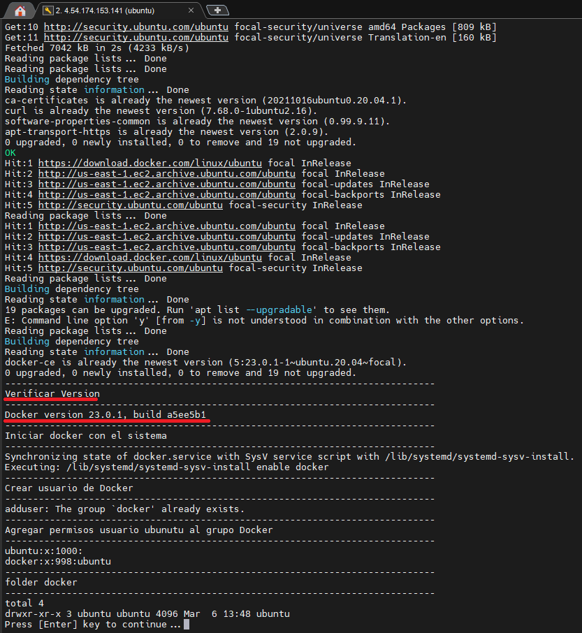
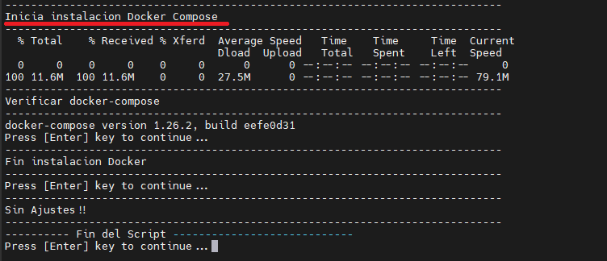

***EXPLICACIÓN SHELL DE ADMINISTRACIÓN***

---

Al ejecutar el respectivo Shell de administración, se podrá visualizar el siguiente menú:


Cuando se ingrese a la ***opción 1***,


se podrá ver el nombre del servidor actual y se le pedirá que confirme la opción para cambiar el nombre del servidor, luego deberá digitar el nuevo nombre del servidor dar enter, y podrá visualizar los cambios en la información que se le mostrará al ejecutarse correctamente la acción.

Al ingresar a la ***opción 2***,


se podrá ver la información de los discos actuales, de los cuales deberá escoger cual desea particionar, primero afirmando la acción y luego digite el nombre del disco, luego debe digitar m, y procederá a ver una lista de información con la que podrá guiarse para realizar la partición. Si el usuario desea salir de esa lista de ayuda debe digitar control+c.

En la ***opción 3***,


podrá ver las IPs actuales de las interfaces de red, luego deberá confirmar la acción, se pedirán tres datos que son el nombre de la red que va a modificar, la IP que
desea colocar y la máscara, si el proceso sale exitosa vera en consola la información de la red con la nueva IP.

En la ***opción 4***,


para cambiar la tabla de host, deberá verificar su acción, además debe dar dos datos, la IP del host que desea agregar, y el nombre del servidor que asignará, si la acción se ejecuta exitosamente se mostrara en consola el archivo que contiene la tabla de hosts y en la última línea podrá visualizar la IP que acaba de agregar.

En la ***opción 5***,


lo redirigirá a un menú que contiene diferentes opciones relacionadas con habilitar el servicio de firewall, ver el estado, habilitar puertos TCP/UDP o habilitar rango de puertos. En cada opción deberá confirmar su acción, y digitar la información solicitada, en caso de habilitar puertos debe ingresar el puerto que desea habilitar, en caso de habilitar rango de puertos deberá digitar del primer rango de puerto y el ultimo rango de puerto (puerto: puerto). Si desea ver los cambios luego de habilitar ciertos puertos podrá hacerlo por medio de la opción 2 que permite ver el estado de firewall, allí podrá ver los cambios.

En la ***opción 6***,


podrá editar el DNS server, debe confirmar la acción, ingresar la IP del servidor DNS que agregará, si es exitoso finalmente podrá ver en consola el archivo donde se encuentran los DNS.


En la ***opción 7***,


podrá configurar el PROXY, primero se mostrará un ejemplo de los datos que se requieren para configurar el proxy, luego debe confirmar la acción, después se le pedirán los datos que observo en la plantilla.


Si todo sale exitoso, se le mostrara en pantalla lo que se agregó al archivo .bashrc.

La ***opción V***, permite volver al menú principal.

La ***opción E***, permite salir de la ejecución del bash.

# Taller Docker 1


***Configuración de herramientas de desarrollo***

- Crear cuenta en Github

  Se debe crear una nueva cuenta en GitHub, ingresa al siguiente enlace https://github.com/join y llena los datos correspondientes.
  
  <p align="center">
  
  </p>

  
- Crear cuenta en Dockerhub

  Se debe crear una nueva cuenta en Docker, ingresa al siguiente sitio https://hub.docker.com/signup y llena los datos correspondientes.
  
  <p align="center">
  
  </p>
  
- Creación de repositorio
  
  Para crear un repositorio nuevo se debe ingresar a la cuenta creada anteriormente en GitHub, donde debera dar clic en el cuadro rojo que indica al boton NEW
  
  <p align="center">
  
  </p>
  
  Luego podrá ver la siguiente pantalla, donde debera colocar el nombre del repositorio, indicar si es publico o privado y llenar demas datos.
  
  <p align="center">
  
  </p>

- Configuración de llaves SSH

  Primero debemos ubicarnos en el servidor que se esta trabajando, para generar las llaves SSH se debe ejecutar el comando ssh-keygen, despues de ejecutar este comando   se debe copiar la llave que se genero en la sigueinte ruta /home/ubuntu/.ssh/id_rsa.pub el archivo id_rsa.pub, la lalve se visualizara de la siguiente forma:
  
  <p align="center">
  
  </p>
 
  Luego debe ubicarse en GitHub -> Settings -> SSH and SPS Keys -> Agregar una nueva llave SSH
  
  <p align="center">
  
  </p>
  
  Allí debe asignarle el nombre y la key generada en el servidor, y finalmente debe dar clic en agregar llave SSH.
  
  <p align="center">
  
  </p>
  
  Después de esto podrá clonar el codigo de su repositorio con la url SSH obtenida de GitHub, en  la maquina AWS en donde genero la llave SSH.
  
  
# Taller Docker 2

- Agregar modulo de instalación de Docker en menú de administración para instalación y pruebas unitarias.
  
  Para este punto se uso el mismo script de administración que se estaba construyendo, donde se le agregó la opción 8 para mostrar la opción de instalación de Docker.

```bash
 "- --------------------------------- -"        
 "-  Menu de administración           -"        
 "- --------------------------------- -"        
 "-  1. Cambiar nombre Servidor       -"        
 "- --------------------------------- -" 
 "-  2. Cambiar Partición Discos      -"        
 "- --------------------------------- -" 
 "-  3. Cambiar IP Servidor           -"        
 "- --------------------------------- -" 
 "-  4. Cambiar tabla de Host         -"        
 "- --------------------------------- -" 
 "-  5. Agregar Permisos de Firewall  -"        
 "- --------------------------------- -" 
 "-  6. Editar DNS Server             -"        
 "- --------------------------------- -" 
 "-  7. Configurar proxy              -"        
 "- --------------------------------- -" 
 "-  8. Instalación de Docker         -"        
 "- --------------------------------- -"
 "-  V. Volver Menu Principal         -"  
 "- --------------------------------- -"      
 "-  E. Exit                          -"        
 "- --------------------------------- -"
```

  código del módulo para la instalación y pruebas de Docker

```bash
"-----------------------------------------------------------------------------"
"Inicia instalacion docker CE                                                " 
"-----------------------------------------------------------------------------"   
read -p">> Paso 1: Desea Instalar Docker (y/n)?" answer
if [[ $answer =~ ^[Yy]$ ]]
then                    
  cd ~/
  "-----------------------------------------------------------------------------"
  "Instalación Prerequisitios"                    
  "-----------------------------------------------------------------------------"                    
  sudo apt-get update -y                    
  sudo apt install apt-transport-https ca-certificates curl software-properties-common -y
  curl -fsSL https://download.docker.com/linux/ubuntu/gpg | sudo apt-key add - 
  sudo add-apt-repository"deb [arch=amd64] https://download.docker.com/linux/ubuntu focal stable" -y
  sudo apt update -y                    
  apt-cache policy docker-ce -y                    
  sudo apt install docker-ce -y
  "-----------------------------------------------------------------------------"                    
  "Verificar Version"                    
  "-----------------------------------------------------------------------------"                    
  docker --version
  "-----------------------------------------------------------------------------"                    
  "Iniciar docker con el sistema"                    
  "-----------------------------------------------------------------------------"                    
  sudo systemctl enable docker
  sudo systemctl start docker
  "-----------------------------------------------------------------------------"                    
  "Crear usuario de Docker"                    
  "-----------------------------------------------------------------------------"
  sudo adduser docker
  "-----------------------------------------------------------------------------"                    
  "Agregar permisos usuario ubunutu al grupo Docker"                    
  "-----------------------------------------------------------------------------"                    
  user=$(whoami)                    
  sudo usermod -G docker $user                    
  grep $user /etc/group
  "-----------------------------------------------------------------------------"                    
  "folder docker"                    
  "-----------------------------------------------------------------------------"                    
  folder=/Images
  sudo mkdir -p $folder/$user                    
  sudo mkdir -p $folder/$user/Data
  sudo chown -R $user:$user $folder/$user                    
  sudo chown -R $user:$user $folder/$user/Data
  ls -ltr $folder/
  read -p"Press [Enter] key to continue..." readEnterKey
  "-----------------------------------------------------------------------------"                   
  "Inicia instalacion Docker Compose                                           "                    
  "-----------------------------------------------------------------------------"                    
  sudo mkdir -p /usr/local/bin
  sudo curl -L"https://github.com/docker/compose/releases/download/1.26.2/docker-compose-$(uname -s)-$(uname -m)" -o /usr/local/bin/docker-compose
  sudo chmod +x /usr/local/bin/docker-compose
  "-----------------------------------------------------------------------------"                    
  "Verificar docker-compose"                    
  "-----------------------------------------------------------------------------"                    
  sudo docker-compose --version
  read -p"Press [Enter] key to continue..." readEnterKey
  "-----------------------------------------------------------------------------"                    
  "Fin instalacion Docker                                                      "                    
  "-----------------------------------------------------------------------------" 
  read -p"Press [Enter] key to continue..." readEnterKey
fi      
"-----------------------------------------------------------------------------"            
"Sin Ajustes!!"            
"-----------------------------------------------------------------------------"
 ---------- Fin del Script ----------------------------           	
read -p"Press [Enter] key to continue..." readEnterKey
```

- Clonar repositorio
  
  Para clonar el repositorio se debe ubicar dentro del repositorio, y elegir la opción de la parte superior derecha dando clic en code -> SSH -> y el enlace debe copiarlo. 

   <p align="center">
    
   </p>

    Con el enlace copiado debemos ir a la maquina para ejecutar el comando que permitirá clonar el repositorio, como se muestra en la imagen:

   <p align="center">
    
   </p>

    Finalmente se realiza la configuración de las variables globales:

   <p align="center">
    
   </p>
 

- Instalar Shell en servidor de AWS

  Para instalar el Shell en el servidor AWS, nos ubicamos en la carpeta del repositorio que se clono anteriormente, luego debemos ubicarnos en la rama que se creo para el taller 2 -> adminDocker-sh. 
  
  <p align="center">
    
  </p>
  
  Finalmente, subimos el script que se desarrollo por medio de mobaxterm en la carpeta del repositorio que se clono anteriormente. 
  <p align="center">
    
  </p>

- Subir cambios a repositorio
  
  Después de haber instalado la shell, se procedera a subir los cambios, para esto se ejecutan los siguientes comandos:
  
  <p align="center">
    
  </p>
  
  Si revisamos el repositorio debe visualizarse el nuevo archivo script.sh, como se visualiza en la siguiente imagen:
  
  <p align="center">
    
  </p>  


- Pruebas (docker –versión y Docker-compose --version)
  
  Para iniciar las pruebas, primero se debe de dar permisos al script desde el servidor AWS, por medio del siguiente comando:
  
  <p align="center">
    
  </p>  
  
  Luego se podrá ejecutar el script con el comando ./script.sh, esto nos permitirá ver el menu que se mostrara a continuación, el cual contiene la opción 8 Instalación Docker, al elegir esta opción se le pedira al usuario afirmar si desea instalar docker
  
  <p align="center">
    
  </p>  
  
  Al confirmar la acción, se empieza a evidenciar en pantalla el paso a paso de la instalación, y también se podrá visualizar la versión de Docker como se muestra en la siguiente imagen:
  
  <p align="center">
    
  </p>  
  
  Finalmente, se visualizará la instalación de Docker Compose:
  
  <p align="center">
    
  </p> 
  
